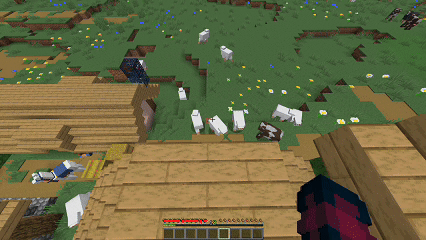
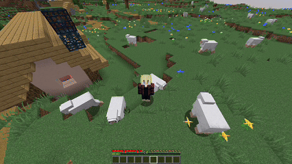
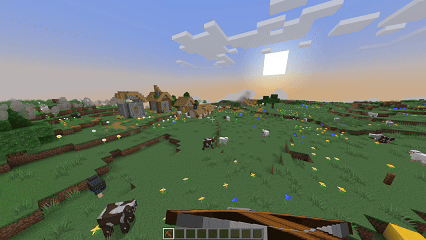
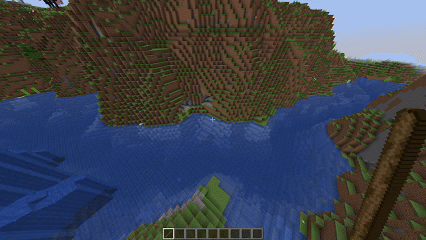
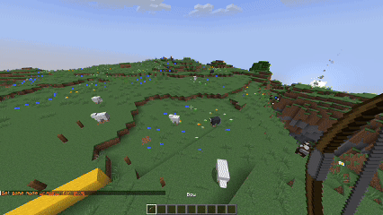

Abilities
===========

Enables players to use various abilities in the game.

### Fall Damage Spreader

With this ability players can spread their fall damage to the surrounding entities. The damage spread reaches up to 3 
blocks in x and z directions. The damage an entity takes is a percentage of the fall damage based on its distance to the
damage dealing player. For example an entity with a distance of 1.5 blocks will receive 50% of the player's fall damage.

It is important to know that the fall damage spreader can deal more damage to surrounding entities than fall damage that
should be received by the player. The dealt damage will be subtracted from the player's fall damage. If the damage 
spreader deals more damage, than the fall damage the player should receive, the player will be unharmed after the fall.

------

### Tornado

Players can create a tornado around them if they start sneaking. The tornado will show its presence with cloud particles
storming around the player. If other entities get to close to a tornado, they will be picked up from the ground and
thrown through the air.

This is a more defensive ability as it throws entities away from a player and doesn't deal damage directly. 
Nevertheless, entities may take damage by falling to the ground after thrown by the tornado.

------

### Ender Shot

Crossbows now act as a sort of rocket launcher. Those rockets are not subject to gravity and will fly for around 10 
seconds. If they hit something, they will create a small explosion and deal 5 hearts of damage to the hit entity. 
Otherwise, they will simply vanish.

------

### Water Bending

Right-clicking on water enables players to pick up water and move it around in the air. Another right-click places the
water in the air.

This ability is just for fun and has no real use-case (at least I've found none so far).

------

### Heat Seeking Arrows

When aiming with a bow a player can choose a target entity. Possible targets will be marked with an aqua glowing effect.
After shooting the arrow, it will be automatically guided to its target. Guided arrows will have a blue flame trail 
while unguided arrows leave a normal trail. Guided arrows do not automatically avoid obstacles, but can be used to hit
targets behind obstacles, for example, by aiming in the air to that the arrow flies over the obstacle.